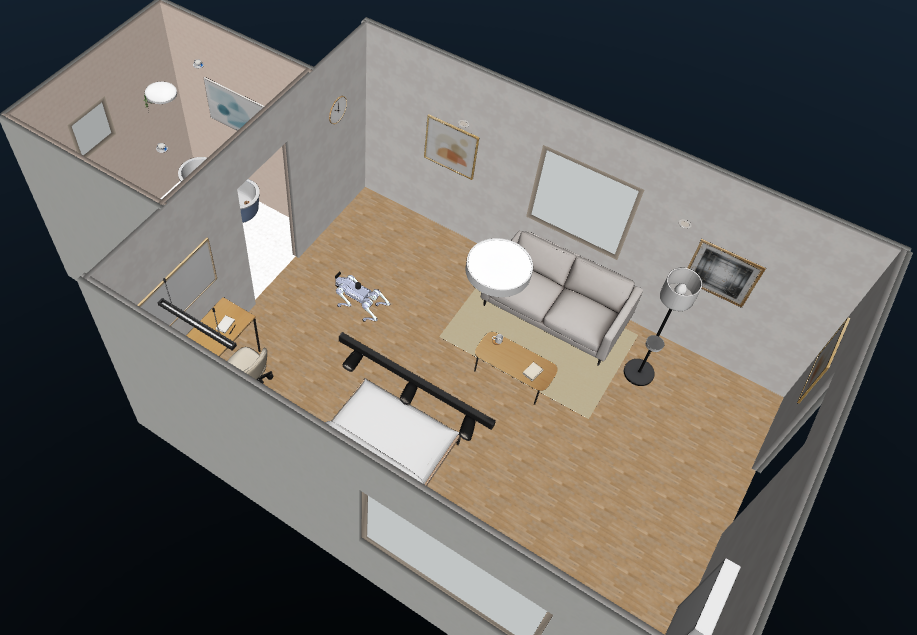
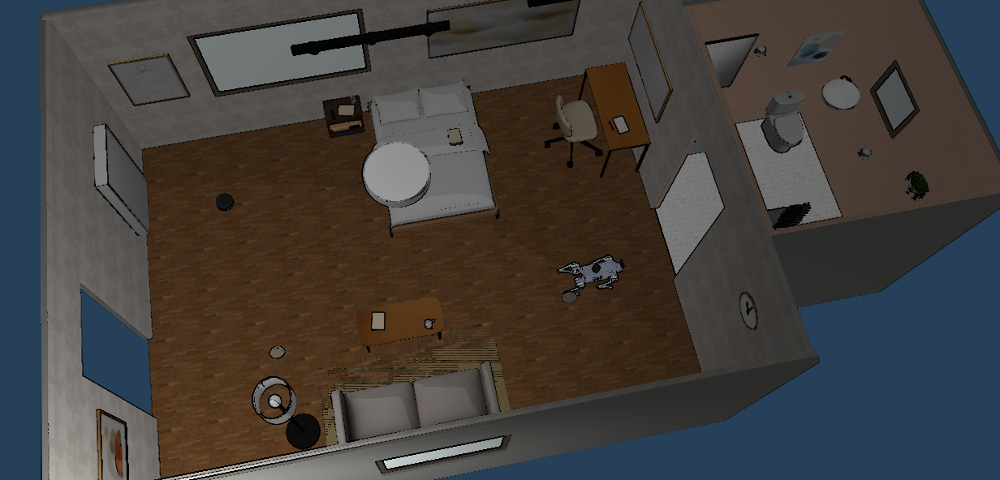
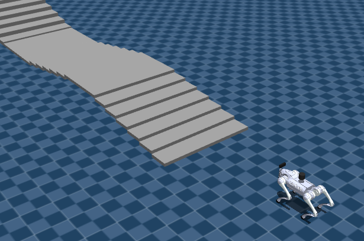
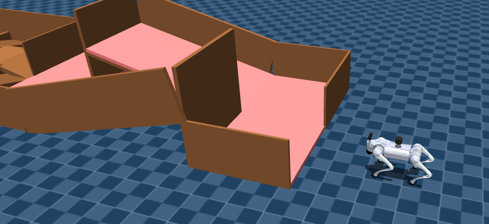
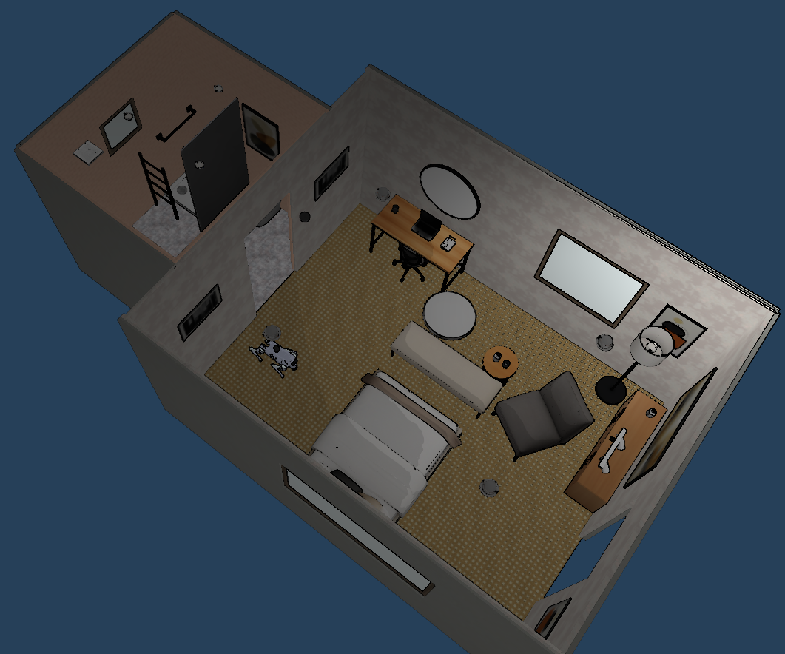
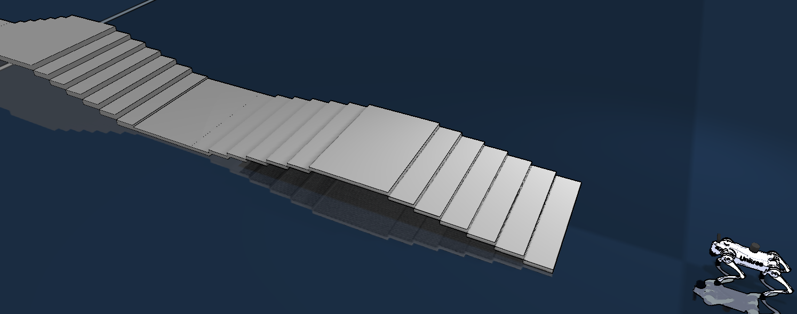
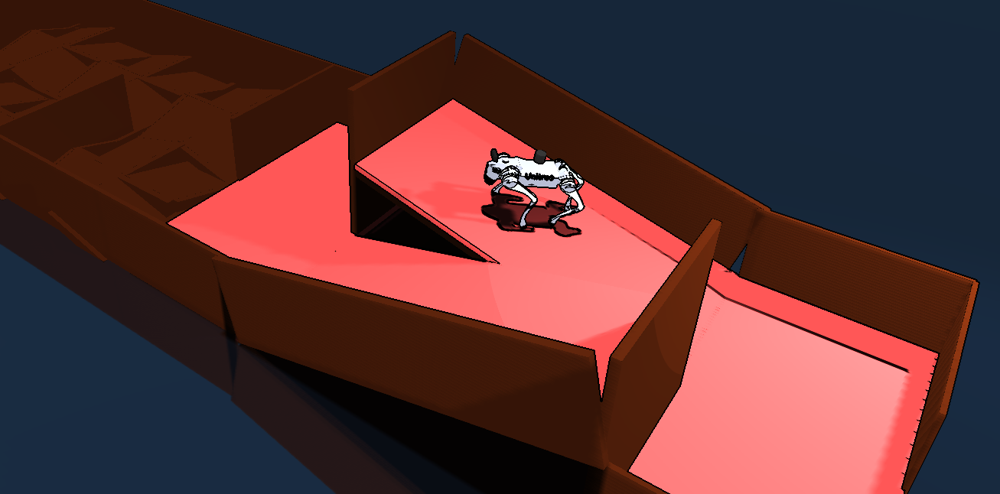
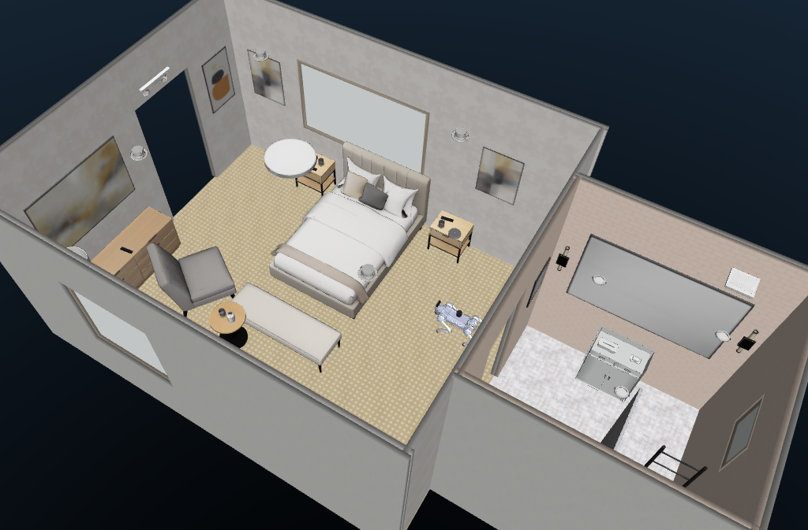
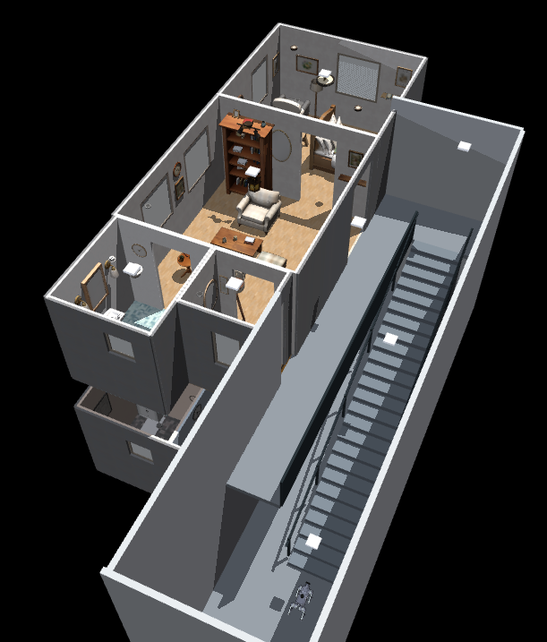
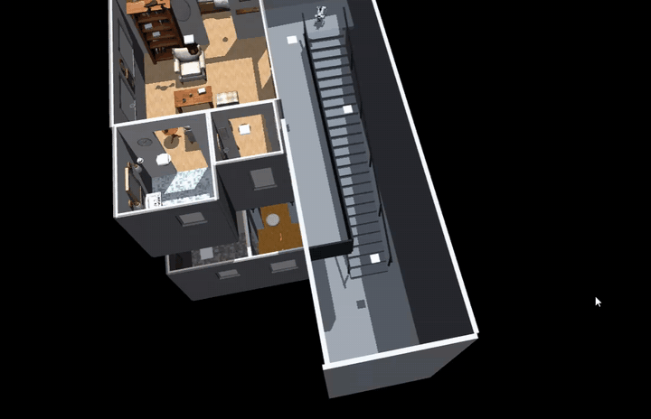

# Unitree Go2 MuJoCo for Robonix

<p align="center">
  <strong>English</strong> | <a href="README.zh-CN.md">简体中文</a>
</p>

<p align="center">
  
</p>

A self-contained Robonix body package for a simulated Unitree Go2. It provides
Web MuJoCo WASM and native Python MuJoCo backends with the same chassis, LiDAR,
IMU, RGB-D, mapping, exploration, navigation, and Scene capabilities.

The included `go2_rl_gym` MoE ONNX policy can be loaded or disabled while the
simulator is running and is **disabled at startup**. Without the policy, a
deterministic gait handles indoor flat-floor motion. The package contains no
physical Unitree transport, arm, speech, or policy-training dependency.

## Demo

### Indoor Navigation

| Web MuJoCo | Native MuJoCo |
| --- | --- |
|  |  |
| SceneSmith House 185 | SceneSmith House 185 |

Both backends publish the same simulated ROS 2 sensor and odometry interfaces.
MuJoCo geometry remains the source of collision, LiDAR, and depth data; the
SceneSmith Mesh assets provide the visible environment.

### Rough-Terrain Policy

| Stair course | Race track |
| --- | --- |
|  |  |
| `go2_rl_stairs` | `go2_rl_track` |

These courses are intended for direct policy evaluation. They do not provide
the calibrated maps and semantic annotations used by indoor navigation.

## Capabilities

| Component or service | Provider | Exposed capability |
| --- | --- | --- |
| Go2 base | `go2_chassis` | Measured relative motion, continuous Twist input, odometry |
| MID-360 LiDAR | `mid360_lidar` | 2D LaserScan, 3D PointCloud2, snapshots |
| MID-360 IMU | `mid360_imu` | Angular velocity and linear acceleration |
| Front RGB-D camera | `front_camera` | RGB, optical depth, calibration, snapshots |
| RTAB-Map | `mapping` | Occupancy map, fused cloud, map-frame pose, persistence |
| Nav2 | `nav2` | Absolute pose navigation, speed limits, obstacle avoidance |
| Scene | `scene` | Observed objects, spatial context, safe nearby goals |
| Explore | `explore` | Asynchronous frontier exploration |
| Floor transition | `floor_transition` | Calibrated stair traversal and per-floor map switching |

Relative commands such as "move forward 0.3 metres" use measured chassis
odometry. Absolute map coordinates and Scene object destinations use Nav2.
Semantic navigation only targets objects actually observed through the RGB-D
camera; simulator object coordinates are not injected into Scene.

## Architecture

```text
rbnx chat / rbnx ask
        |
Pilot + Executor + Atlas + Soma
        |
Scene / Mapping / Nav2 / Explore / Floor Transition
        |
four local primitives
        |
ROS 2 <-> WebSocket bridge <-> Web MuJoCo WASM
                         \----> native Python MuJoCo
                               |-- joint-torque control
                               |-- LiDAR, IMU and RGB-D
                               `-- optional ONNX inference
```

Robot dimensions and capability composition are defined in `soma.yaml`; the
transform tree is in `urdf/go2.urdf`; robot-specific Mapping and Nav2 parameters
live in `config/`. See [simulation architecture](docs/ARCHITECTURE.md) for the
runtime boundaries.

## Requirements

The package is designed for x86_64 Ubuntu 22.04 or WSL2 with:

- Docker Engine and the Compose plugin;
- Node.js 20 or newer, Python 3.10+, `uv`, and `curl`;
- an installed `rbnx` CLI and a local Robonix source tree;
- Chromium with WebGL 2 for the Web backend;
- X11/WSLg, hardware OpenGL, and the configured GPU device for the native viewer;
- network access to npm, GitHub, and Playwright downloads during bootstrap.

Native MuJoCo physics and the included ONNX network run on CPU. The native
viewer and offscreen RGB camera use OpenGL. `--headless` closes the viewer but
still requires working camera rendering.

## Installation

### 1. Install Robonix

Install Robonix and make its source tree available locally.

### 2. Configure this body package

```bash
git clone <repository-url> ~/robot-unitree-go2_mujoco
cd ~/robot-unitree-go2_mujoco
cp .env.example .env
```

Edit `.env` and provide at least:

```dotenv
ROBONIX_SOURCE_PATH=/home/your-name/robonix
VLM_BASE_URL=your-model-url
VLM_API_KEY=replace-me
VLM_MODEL=your-model-name
```

Keep credentials in the ignored `.env` file or exported environment variables.
The simulator itself does not need a VLM key; Pilot and Scene use it for
language and visual reasoning.

### 3. Bootstrap

```bash
bash scripts/bootstrap.sh
```

Bootstrap installs frontend dependencies and Playwright Chromium, builds the
ROS 2 bridge image, generates primitive bindings, validates local packages, and
builds the Robonix deployment. Runtime assets and the pretrained policy are
already included; ordinary startup does not download SceneSmith datasets or
train a policy.

## Start

Use three terminals. Only one simulator backend and one Robonix stack may own
the configured ROS graph and ports at a time.

### Terminal 1: MuJoCo Simulator

Web backend:

```bash
cd ~/robot-unitree-go2_mujoco
bash sim/start.sh --backend web --environment scenesmith_house_185
```

Native viewer:

```bash
bash sim/start.sh --backend native --viewer --environment scenesmith_house_185
```

Native without the viewer:

```bash
bash sim/start.sh --backend native --headless --environment scenesmith_house_185
```

Wait for `[sim/start] ... ready`. The operator pages are:

```text
Web:          http://127.0.0.1:5181/
Native panel: http://127.0.0.1:5181/?backend=native
Bridge:       http://127.0.0.1:8766/health
```

### Terminal 2: Robonix Body Package

```bash
cd ~/robot-unitree-go2_mujoco
source scripts/env.sh
rbnx boot --no-update-check
```

Run `rbnx boot` from the repository root so it finds
`robonix_manifest.yaml`. Mapping, Nav2, Scene, and the four primitives should
become `ACTIVE`; skills may remain inactive until requested.

### Terminal 3: Chat

```bash
cd ~/robot-unitree-go2_mujoco
source scripts/env.sh
rbnx caps -v
rbnx tools
rbnx chat
```

Example requests:

```text
Capture the front camera and describe the room.
Move forward by 0.3 metres.
Navigate to map coordinate x=6.09, y=2.05 with final yaw=0.
Explore the rooms for 120 seconds at no more than 0.18 m/s and return the task ID.
List the objects observed by Scene.
Move near the closest observed table.
In the multilevel house, go upstairs, downstairs, or to floor 1/2.
```

Exploration and floor transition are asynchronous. Keep the returned `run_id`
for status and cancellation. Do not run direct motion, navigation, exploration,
or floor transition concurrently.

## Policy and Controls

The policy selector and `Load / Disable Policy` action are in the top-right
`Simulation > Policy` folder for both backends. Loading or disabling a policy
does not reset the robot pose. Production mode leaves motion under Robonix and
does not register keyboard driving or native viewer motion callbacks.

Enable local keyboard driving explicitly for development:

```bash
bash sim/start.sh --backend web --dev --environment go2_rl_stairs
bash sim/start.sh --backend native --viewer --dev --environment go2_rl_stairs
```

Development keys are W/S forward/backward, A/D yaw, Q/E lateral, Space stop,
and X reset. The native viewer also supports L to load or disable the policy.

The included policy is `go2_moe_cts_high_slope_thre_164k_0.6715` from
`wty-yy/go2_rl_gym`. It consumes five 45-value observation frames, runs at
50 Hz with a 0.002 s physics step, and preserves the upstream joint order,
action scale, and PD gains. See
[policy provenance](assets/robots/go2/policy/moe_rough/UPSTREAM.md).

When the policy is disabled, a deterministic joint-torque gait provides flat
indoor locomotion. When it is loaded, bounded velocity feedback compensates the
released policy for low-speed navigation commands. Neither controller guarantees
safe traversal of arbitrary terrain.

## Environments

| Environment ID | Purpose | Web | Native |
| --- | --- | --- | --- |
| `scenesmith_house_185` | Multiroom living area and bathroom; default mapping/navigation scene | Yes | Yes |
| `scenesmith_house_186` | Multiroom bedroom and bathroom | Yes | Yes |
| `go2_rl_stairs` | Original go2_rl_gym stair course | Yes | Yes |
| `go2_rl_track` | Original go2_rl_gym race track | Yes | Yes |
| `scenesmith_multilevel_house` | Calibrated two-floor house with one straight stair | Yes | Yes; recommended for floor transition |

Stop Robonix and the simulator before changing environments, then restart both
with the new environment ID. This prevents stale maps and semantic poses from
being reused in another scene.

### Environment Gallery

#### Web MuJoCo

| House 185 | House 186 |
| --- | --- |
|  |  |
| Stair course | Race track |
|  |  |

#### Native MuJoCo

| House 185 | House 186 |
| --- | --- |
|  |  |
| Stair course | Race track |
|  |  |

Two-floor house:

<p align="center">
  
</p>

Scene provenance and repeatable import commands are recorded in
[docs/scenes.md](docs/scenes.md).

## Floor Transition

<p align="center">
  <a href="docs/media/floor_transition.mp4">
    
  </a>
</p>

<p align="center">
  <a href="docs/media/floor_transition.mp4">Watch the complete 88-second ascent and descent demo</a>
</p>

`floor_transition` is a deployment-owned skill for the fixed
`scenesmith_multilevel_house` environment. It approaches the calibrated stair
with the deterministic gait, loads `moe_rough` for the stair segment, verifies
position, heading, lane error, body attitude and landing height, then loads the
destination floor map. It supports `UP`, `DOWN`, `GO_TO_FLOOR(1|2)`, status,
and cancellation.

Install the packaged maps before the first run:

The installer expands the repository's xz-compressed databases to
`rtabmap.db` in the runtime map directory; Git LFS is not required.

```bash
bash scripts/install-prebuilt-maps.sh
bash sim/start.sh --backend native --viewer --environment scenesmith_multilevel_house
```

Deterministic commands that bypass Pilot/VLM are available after the simulator
and Robonix stack are running:

```bash
bash scripts/floor-transition.sh up
bash scripts/floor-transition.sh down
bash scripts/floor-transition.sh floor 2
bash scripts/floor-transition.sh floor 1
```

This skill is calibrated for one known straight stair and two packaged floor
maps. It does not discover unknown stairs, select among multiple connectors,
plan a single 2D path across floors, or provide real-hardware safety
certification. Do not copy the existing coordinates to another environment.
See the [multi-floor demo guide](docs/MULTI_FLOOR_DEMO.zh-CN.md) for the state
sequence, annotations, map identities, safety checks, and manual acceptance.

## Validation

Offline checks:

```bash
npm test
python3 -m unittest discover -s primitives/tests
```

Live checks after starting the simulator and Robonix:

```bash
# Sensors, registered providers and map:
bash scripts/acceptance.sh --require-stack --require-map

# Measured forward/backward and +/-30 degree rotation:
bash scripts/acceptance.sh --relative 0.4

# Absolute map-frame arrival and cancellation; choose a free mapped pose:
bash scripts/acceptance.sh --navigate 5.6 2.4 --yaw 0

# Scene object approach and autonomous exploration:
bash scripts/acceptance.sh --semantic --object-id scene.object.table_001
bash scripts/acceptance.sh --explore --explore-duration 150 --explore-timeout 240 --explore-speed 0.18

# Native model, sensors and policy switching:
docker exec mujoco_go2_sim python3 /workspace/sim/tests/native_smoke.py --environment all --policy
```

Acceptance moves the robot. Run motion and navigation once with `moe_rough`
disabled and once after loading it, without another active controller.

## Stop

```bash
cd ~/robot-unitree-go2_mujoco
source scripts/env.sh
rbnx shutdown
bash sim/stop.sh
```

The lifecycles are independent: `rbnx shutdown` does not stop MuJoCo, and
`sim/stop.sh` does not stop Robonix. Logs are written under `.runtime/` and
`rbnx-boot/logs/`.

## Add Environments

Environment packages are registered in `assets/environments/manifest.json`.
A Mesh environment normally contains `scene.xml`, `index.json`, `spawn.json`,
and referenced meshes/textures. SceneSmith conversion, collision preparation,
spawn search, map generation, and source checksums are documented in
[docs/scenes.md](docs/scenes.md). Add new environments as environment packages;
do not duplicate the Go2 primitives or policy controller per scene.

## Limitations and Safety

- This package controls a simulated Go2; it is not a real-hardware safety layer.
- Direct relative motion is not collision-aware; use Nav2 for room-scale travel.
- Scene cannot navigate to an object that has not been observed.
- Exploration, navigation, direct motion, and floor transition require exclusive
  motion ownership.
- The rough-terrain policy is a released pretrained controller, not a guarantee
  of success on arbitrary stairs, slopes, friction, or obstacle geometry.
- Resetting or dragging the robot invalidates active Mapping/Nav2 tasks and
  persisted floor-transition assumptions.

## Repository Layout

| Path | Purpose |
| --- | --- |
| `assets/robots/go2/` | Go2 MJCF, meshes, deterministic controller and ONNX policy |
| `assets/environments/` | Independently selectable scene packages |
| `primitives/` | Chassis, LiDAR, IMU and RGB-D providers |
| `skills/explore/` | Frontier exploration adaptation |
| `skills/floor_transition/` | Calibrated two-floor stair skill |
| `sim/native/` | Native MuJoCo runtime and policy inference |
| `sim/bridge/` | ROS 2 and WebSocket bridge |
| `src/` | Web MuJoCo runtime, sensors and operator panel |
| `config/`, `soma.yaml`, `urdf/` | Navigation, body composition and transforms |
| `robonix_manifest.yaml` | Robonix deployment entry point |

## Upstream Projects and License

The integration follows runtime patterns from
[mujoco_robonix](../mujoco_robonix), builds on
[MuJoCo-GS-Web](https://github.com/Vector-Wangel/MuJoCo-GS-Web), and references
the [real Go2 Robonix body package](https://github.com/syswonder/robot-unitree-go2).
MuJoCo model assets retain their Unitree BSD notice; the frontend foundation
retains its MIT license. SceneSmith assets and go2_rl_gym weights/courses retain
their upstream notices. See [NOTICE](NOTICE) and the repository license files.
